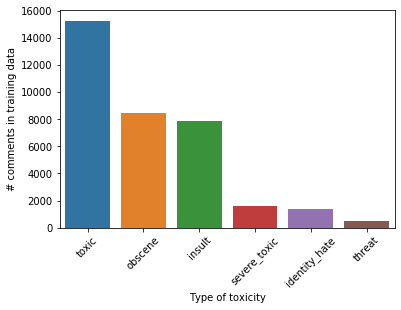
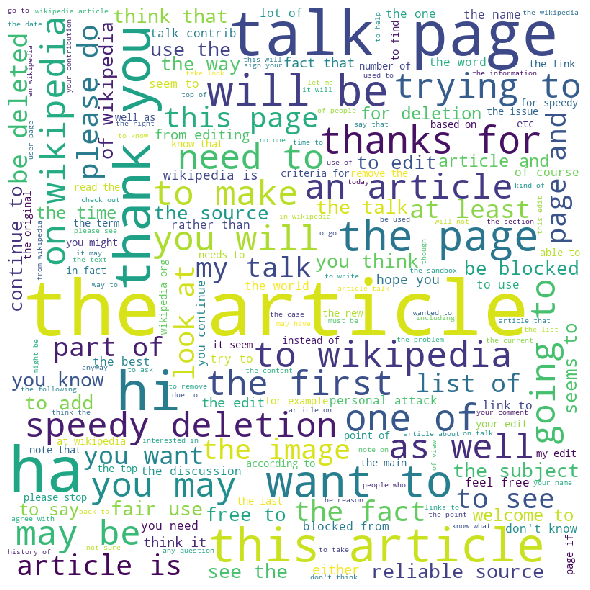

## Toxic Comment Classification

**Project description:** This project aims to detect different types of of toxicity like threats, obscenity, insults, and identity-based hate on online platforms. The dataset of comments comes from Wikipedia’s talk page edits. The methods discussed in this project will hopefully help online discussion become more productive and respectful.

*Disclaimer: the dataset for this project contains text that may be considered profane, vulgar, or offensive.*

### 1. Data Set

The dataset contains a large number of Wikipedia comments which have been labeled by human raters for toxic behavior. The types of toxicity are:

- toxic
- severe_toxic
- obscene
- threat
- insult
- identity_hate

### 2. Data Visualization

The plot below shows the distribution of comments in different buckets. 

As can be seen from the image, highest numner of comments are marked as toxic, followed by obscene and insult. Severly toxic and identity hate comments are lower are lower in number and threats are the least. 

The figure below shows the word cloud for clean images.

### 3. Data pre-processing

As we have text data in the form of comments the following preprocessing steps were taken:
- Remove punctutaions, special characters
- remove stop words
- lemmatize the words
- create unigrams and bigrams
- tokenize the comments

These steps prepare the training data that can be fed to our model.

### 4. Model

I tried three models for this task. First model is a Naive-Bayes- SVM model. Naive Bayes uses bag of words model and thus not consider context. But this simple model gives 97.7% accuracy. Next I also tried a LSTM based deep model. I tried training embedding vectors as well as using Glove embeddings. Glove embeddings work better and improve the accuracy slightly. And lastly, since both these methods are very different I tried stacking both the models which improved the results even further. [Here]() is the link to the GitHub repo.

